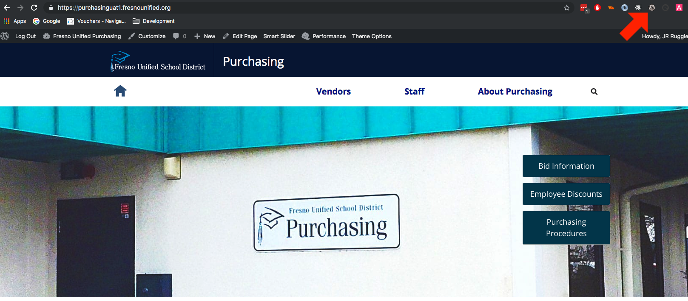
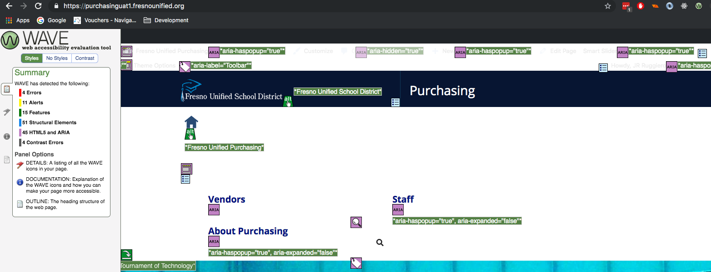
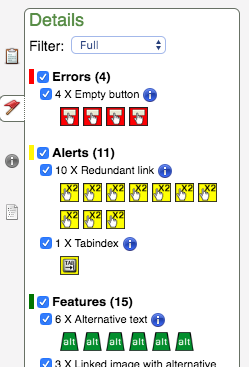
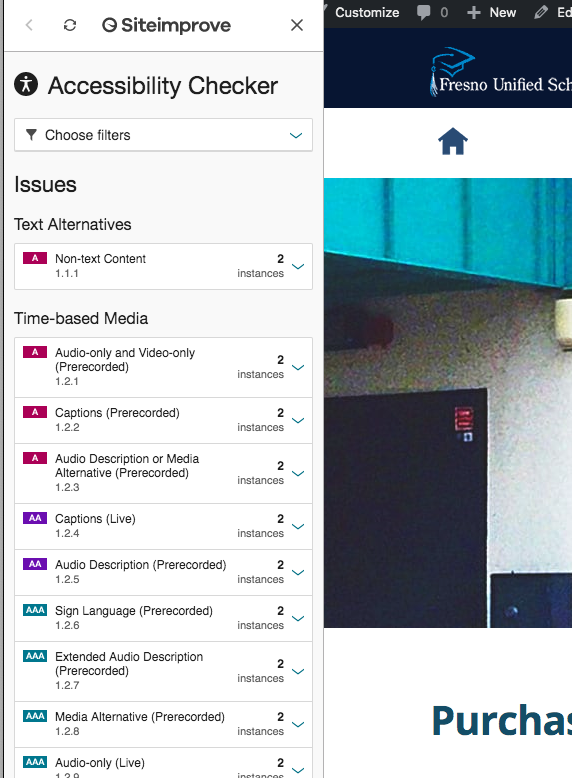
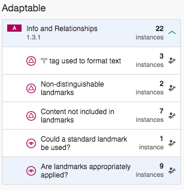
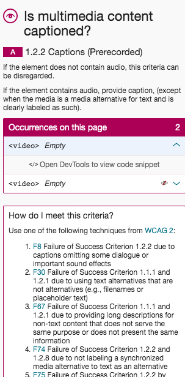
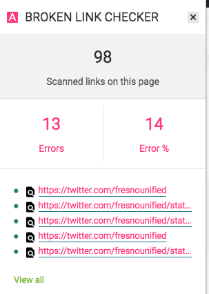

# WCAG Testing Procedure

This is the procedure that has been used to test the FUSD WordPress sites

## Automated testing

There are 3 primary tools used in testing, they are all Chrome browser extensions:

- [WAVE Browser Extension for Chrome and Firefox](https://wave.webaim.org/extension/)
- [SiteImprove Browser Extension](https://siteimprove.com/en-us/core-platform/integrations/browser-extensions/)
- [Broken Link Checker](https://chrome.google.com/webstore/detail/broken-link-checker/nibppfobembgfmejpjaaeocbogeonhch)

The first two go over the site currently loaded in the browser and point out possible issues. The third will test all links on a site. The first two tests should be done on as many pages as a user is likely to encounter upon a visit. If you can check all of them, great, but if your site has 100 pages, and 95 of those are the result of a template, you don't need to check all 100.

The link checker, on the other hand, should be done on as much of the site as possible to avoid any broken links.

### WAVE

Make sure that you don't have any ancillary dashboards present on the site. For example, if you are logged into a WordPress admin account and then go to that page, you will have the WP admin bar on the top of the screen. You don't want that; automated testers will hit that as well. Once that's taken care of, simply navigate to the website you wish to test and then click the WAVE icon in your browser:

This will display several landmarks on the screen and a summary on the left side

Clicking on the "Contrast" tab will display details on any contrast errors in your page. Clicking the flag icon on the left will display the details of errors/alerts on the page:

This will display any Error and Alerts on the page. Errors should always be fixed. Alerts can sometimes be ignored. For example, any link to a PDF file will prompt an alert because PDFs can't be tested automatically. Clicking the blue **i** next to the alert will give you a more detailed descripion as to why this is a problem and how it can be remedied.

You don't need to worry about the other categories; the next automated test will present your ARIA landmarks in a way that's easier to evaluate, but this can be helpful to get an overview of the features and landmarks of your page.

One neat feature that comes with WAVE displays a small green tab labeled **`<code>`**. Clicking this will pull up the page's code similar to the inspector. If you open this tab and then click on a particular error or alert on the left side, the code section will be highlighted like this:

### SiteImprove

The Site improve plugin works in a similar fashion to the WAVE plugin, but will also alert you to things that require manual review. As before, make sure that you don't have any CMS admin bars like WordPress active. Just like the WAVE plugin, you simply click the icon, although it's ridiculously difficult to see:

Once you click the icon, it will display the issues on the left side of the page:

This plugin groups the issues according to the WCAG rule that they apply to. You can click on the issue and view all the instances:

From there you can click on the instances and you will receive more details:

You can also view the offending code with this plugin, but you must first have your inspector open. Once you do, click on the sections labeled, "View code snippet in DevTools" and you can see the code:

There are some things that will always flag as an alert in this plugin because they must always be manually reviewed, such as time-based content or text inside pictures. The SI plugin will also ask you to review ARIA labels and landmarks to ensure they are both descriptive and appropriately applied.

### Link Checker

This one is pretty straight forward, simply click the icon to test all the links on your page:

A box on the top right will display how many links were checked and any errors that arise:

The link checker will also color any links on the page green or red based on whether or not they pass:

## Keyboard Testing

The site must be fully navigable with a keyboard only, and any actions that are vital to the function of your app/site must be doable with only a keyboard. For this test, you will want to go through every single instance of your application and make sure navigation and functionality are properly retained.

Two main things to look for:

- How is the tab-order focus handled? Is it very clear where exactly the focus is on the page, or do you lose track a few tabs in?
- Are there any keyboard traps? For example, is there a button that when clicked opens a modal that can only be closed by a mouse?

Simply put, ask yourself if you only had a keyboard, would you be able to properly use the app and get the same experience as a mouse.

## Mobile Testing

The same principles for keyboard testing go here, does the site/app function on a mobile device? Be sure to test on both an Apple and an Android device. Make sure the content is responsive. Other questions you should ask:

- Does the site display fine in both landscape and portrait?
- Is there any functionality that requires a complex motion such as drawing lines?

## WCAG Familiarity

Make sure to go through other aspects of the [WCAG Guidelines](https://www.w3.org/TR/WCAG21/) that would require manual review. The SI plugin does a pretty good job of making sure you check the important stuff. Some common questions:

- If content on the page changes be sure it is handled appropriately.
- If there's any time limit on a page be sure it can be disabled.
- If there is automated action (such as autoplay a video/sound, or a carousel), there must be an option to disable it.

